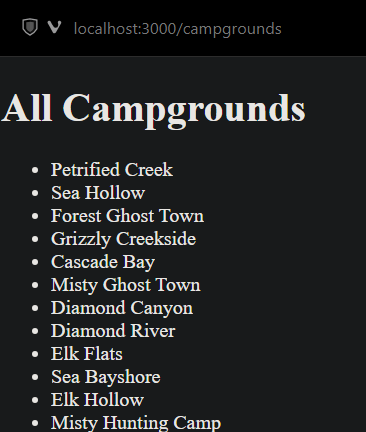
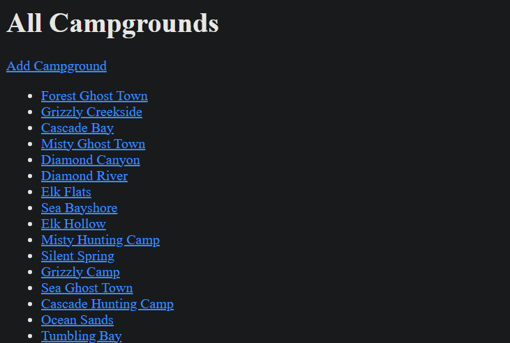
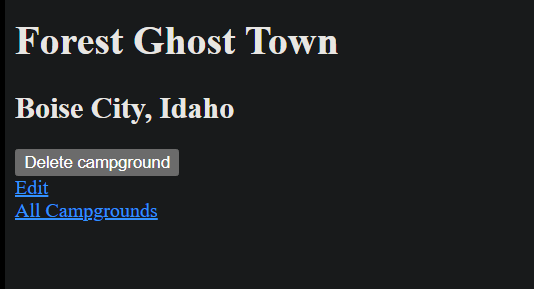
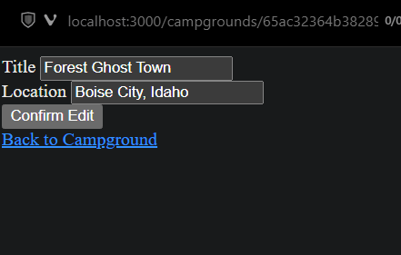
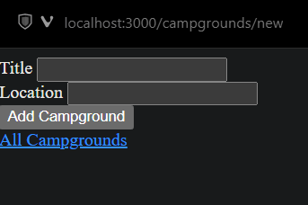

This is project is based on **Web Development BootCamp 2023** by **Colt Steele** in **Udemy**. Section 39: YelpCamp: Campgrounds CRUD.
`21/01/2023 by **me-maeself**`
---
TODO learn import export
TODO learn path

# Overview
Features of the YelpCamp project:
- Map
- Locations
- Authentication
- Creation
- Indexing

# 419. How to access YelpCamp Code
- the resource button direct us to a specific commit in github repo.

# 420. Creating Basic Express App
- npm init
- npm i express ejs mongoose 

# 421. Campground: Model Basic
- making views
  - home.ejs
- making models
  - campground
- making home route
- making makecampground route

# 422. Campground: Seeding
- created seeds directory
  - made index.js
    - seed 50 campground
      - location
      - description

# 423. Campground: Index
- created /campgrounds route
- mkdir views/campgrounds
  - code index.js
    - list all title

# 424. Campgrounds: Show
- create show detailed page of a campground via campgrounds/:id
  - edited app.js
  - try and catch id
  - created show.ejs

# 425. Campgrounds: New
- get and post route handling on app.js
- new.ejs
- added navigation button on each page
- app.use(express.urlencoded({ extended: true }));

# 426. Campground: Edit and Update
- npm i method-override
  - const methodOverride = require("method-override");
  - app.use(methodOverride("_method"));
- edit.ejs

# 427. Campground: Delete
- app.delete("/campgrounds/:id")

# Final result:

